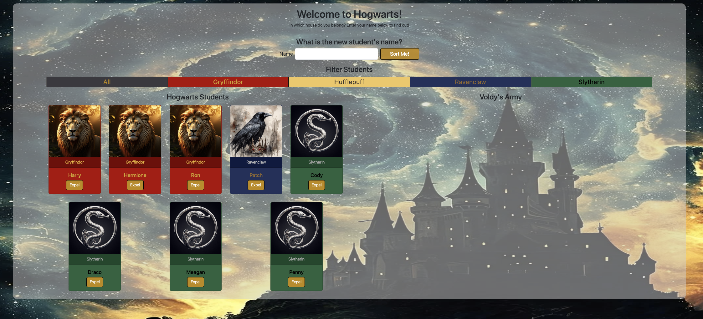

# Sorting Hat

(https://app.netlify.com/sites/sorting-hat-cody-keener/deploys)

Welcome to Hogwarts! You are a first year student at the prestigous Hogwarts school of witchcraft and wizardry, but before you can begin classes, you must first be sorted into a school house! Put on the Sorting Hat and find out in which house you belong. Then have fun sorting your friends, pets, and enemies and then expelling those who don't deserve to be at Hogwarts! But be careful, because those expelled students will end up in Voldy's Army! But don't worry, if it turns out they were actually a good guy all along and they <em>always</em> loved your mother, you can readmit them back into Hogwarts.

[View App](#https://sorting-hat-cody-keener.netlify.app)

## Get Started
//function that hides the Sorting Hat card and displays the main page
const startApp = () => {
  sortingHatContainer.toggleAttribute("hidden")
  mainPageContainer.toggleAttribute("hidden")
  renderCards(studentArray, hogwartsStudents)
}

## About the User
- The ideal user for this application is a Harry Potter fan
- They want to know what Hogwarts House they and their friends (or pets) would be in
- The problem this app solves for them is that it allows them to be sorted into a Hogwarts house, sort their friends, and expel their enemies

## Features
- Click the 'Get Sorted' button to be taken to the main application
- Type in a name and click 'Sort Me!' to be sorted into a house and have your card appear in the Hogwarts Students container.
- The color of the student's card changes depending on which house they were sorted, and each house has their own image as well.
- The student cards are ordered alphabetically by house and then by name within each house.
- A separate container holds cards for students that have been expelled and joined Voldy's Army. These cards are styled with a different image and different colors from the Hogwarts students.
- I also added a 'Readmit' button that moves an expelled student back to the Hogwarts Students container with their original house.

## Video Walkthrough of Sorting Hat
https://www.loom.com/share/c38f008044a146008871ae626a0004f0?sid=90cc8557-12d7-41b2-946c-3990534822c3

## Relevant Links
- [Check out the deployed site](#https://sorting-hat-cody-keener.netlify.app/#)

## Code Snippet 
<!-- //function to make Expel button delete card from the hogwartsStudents div and add it to the voldysArmy div -->

const expel = (e) => {
  if (e.target.id.includes("expel")) {
    e.preventDefault()
    
    const [, expelId] = e.target.id.split("--")
    const index = studentArray.findIndex((student) => student.id === Number(expelId))

    const newVoldyObj = studentArray[index]
    console.log(newVoldyObj)
    voldysArmyArray.push(newVoldyObj)
    
    studentArray.splice(index, 1)
    
    renderCards(voldysArmyArray, voldysArmy)
    filterCards(currentFilter)
  }
}

## Project Screenshots

## Contributors
- Cody Keener (https://github.com/codyKeener)

## ------------------------------------------------------------------------------------------ ##

## Instructions I followed:

## Goals
The goal of this project is to test your knowledge and to have a FUN time stretching yourself on your FIRST independent application that will become a part of your portfolio.

Focus on MVP. Do not spend a ton of time styling initially. Hit functionality first and then spend time on the styling of the project using bootstrap.

- READ THROUGH ALL OF THE INFORMATION BELOW before planning how you will tackle the project.
- Check the Issue Tickets to organize your process. You will have all week in class to work on this in class. 
- PLEASE submit questions in help tickets if you need help. We will guide you to the resources that are available to you.
- When done, tell an instructor. Everyone will present how far they got AND their favorite piece of code that they wrote to an instructor.
- MOST OF ALL HAVE FUN!!!!!

## Instructions
You are in charge of bringing the Hogwarts sorting hat to life! 

This is what the finished app should have:
- To start off with, you will use a [bootstrap card](https://getbootstrap.com/docs/5.0/components/card/#header-and-footer) to have your sorting hat introduce itself and start the sorting process (by clicking on a button). The form should not be on the DOM until the button click happens.

- A [bootstrap form](https://getbootstrap.com/docs/5.0/forms/overview/) will then appear to fill in the student's name and a button to sort. This should then assign the student to a random house (Gryffindor, Hufflepuff, Ravenclaw, or Slytherin). 

- On sorting a student, the form should clear and a [bootstrap card](https://getbootstrap.com/docs/5.0/components/card/) with the student's name and a random house assignment should print below the form. 

- You should also be able to expel a student after they have been sorted, which should remove their card from the student array and move them to Moldy Voldy's Army.

In the end, your app will look something like: 

<!-- [See Demo](https://drt-sortinghat.netlify.app/)
 -->
## Technical Requirements
- You MUST plan your project and highly suggest using issue tickets. There are a few that have been provided for you to use already. Continue to add to these so you know what work you need to complete. 
- You MAY use the `renderToDom()` function that we worked on in class, but you also need to be able to explain it if you use it
- You have to create a data structure for your project. Review all the elements that need to be on the DOM and create the structure accordingly
- You must use [Boostrap](https://getbootstrap.com/) to style your page components
- You must use a loop other than a `for loop`
- Your JS file should be comprised of functions, no actions should happen in your code outside of a function except for your initial `startApp()` function
- Your code MUST be YOUR code. Do not copy and paste code into your project. Type every bit of it out
- Your HTML and JS should all have proper indentation
- Helpful Form: An error message shows if a user tries to sort a student without filling out the form
- Voldermort's Army: Create a separate container of cards that hold the cards for students that have been expelled. These should be styled differently from Hogwarts students.
- Add filter buttons to filter the non-expelled students by house

## DEFINITION OF DONE
Once you have completed all the technical requirments, you should complete the following:
- [README Requirements](https://github.com/orgs/nss-evening-web-development/discussions/13)
- **RECOMMENDED** Loom Video: [Sign up for Loom](https://www.loom.com/signup) and record a video of you walking through your app 

## Expel Button Hints
Think of a way you can expel students without just hiding those divs on the page. This would mean when the button is clicked you modify the array of students and pass the new array into your `renderToDom()` function.  Double hint - put a unique id in the student object when you create them.

## Optional Bonus
- House Colors: The color of the student's card changes depending on which house they were sorted.
- Card Sorting/Ordering: Sort the student cards by some criteria (i.e. alphabetically by name, by house)
